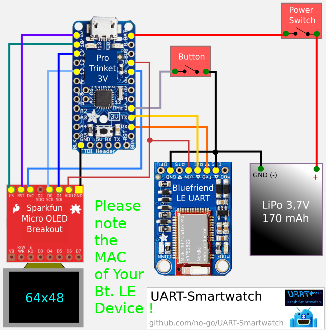

# UART-Smartwatch

This branch is a bit different than the master. Firmware and circuit are
modified to display the power of the LiPo better.

## The Firmware

I add a bigger power range icon from 4.2V (full) to 2.7V (empty). There
is a small tick on it for 3.3V and a bigger tick for 3.7V

I add the temperature mesurement for testing, too.

## Circuit

The 3.3V regulator (BAT Pin) is be IRGNORED! This means, that the OLED Display
get 4.2V (a 3.7V LiPo could do that) INSTEAD of 3.3V ! This could break
the display!

Devices:

- [Adafruit Bluefruit LE UART Friend](https://learn.adafruit.com/introducing-the-adafruit-bluefruit-le-uart-friend)
- [Micro OLED Breakout](https://github.com/sparkfun/Micro_OLED_Breakout)
- [Pro Trinket 3V](https://learn.adafruit.com/introducing-pro-trinket)
- LiPo 3,7V (170mAh)

[UART-Smartwatch Circuit PDF](https://raw.githubusercontent.com/no-go/UART-Smartwatch/powerCritical/stuff/UART-Smartwatch.pdf)

# Sign Of Gratitude

Thank you to [NORDIC SEMICONDUCTOR](http://www.nordicsemi.com/) for the OpenSource App like [nRF UART v2](https://github.com/NordicSemiconductor/Android-nRF-UART) to make it easy to use their products!!
