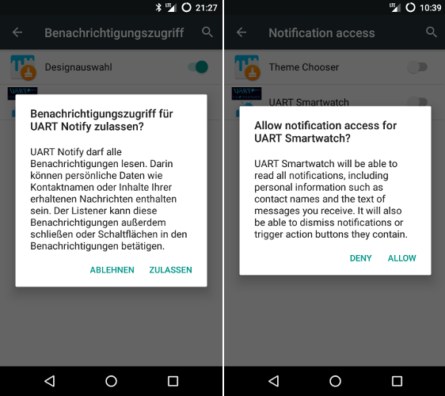

# UART-Smartwatch

Android App, Firmware and Circuit for a DIY Smartwatch working with Bluetooth Low Energy

Features:

- Taste 1500ms drücken: Uhrzeit (sync), Datum und Nachrichten vom Smartphone holen und durchscrollen
- Taste 500ms drücken: Uhrzeit (wird intern weiter gezählt), Batterie und Analog Uhr
- small analog clock
- digital clock
- Battery Level
- more than 18 hours with LiPo 3.7V (170mA)
- some emoticons works

Die DIY Smartwatch kann so auch mal ohne Handy die aktuelle Uhrzeit anzeigen.
Eine Messung ergab, dass nach 6 Stunden die Uhr um ca 1 Min vor geht. Das ist besser,
als wenn die Uhr nach geht, und Bus/Zug oder so etwas verpasst.

## App

[UART-Smartwatch APK](https://raw.githubusercontent.com/no-go/UART-Smartwatch/master/UART-Smartwatch_App/app/app-release.apk) or get the App from [f-Droid](http://f-droid.org)

### Standortzugriff

Aus irgendeinem Grund braucht Android 6 beim Scannen nach BLE Geräten (kurz) Zugriff auf den Standort.

### Benachrichtigungszugriff

Der App muss Zugriff gewährt werden, um die Nachrichten anderer Apps lesen zu können:

## Firmware / Smartwatch

[UART-Smartwatch / Arduino IDE](https://raw.githubusercontent.com/no-go/UART-Smartwatch/master/UART-Smartwatch_firmware/UART-Smartwatch_firmware.ino)

### Circuit

Devices:

- [Adafruit Bluefruit LE UART Friend](https://learn.adafruit.com/introducing-the-adafruit-bluefruit-le-uart-friend)
- [Micro OLED Breakout](https://github.com/sparkfun/Micro_OLED_Breakout)
- [Pro Trinket 3V](https://learn.adafruit.com/introducing-pro-trinket)
- LiPo 3,7V (170mAh)

### Startlogo

In 'stuff/' is a small c program to make you own Smartwatch startup logo:

- make a 64x48 s/w Image
- store it as xbm file (e.g. with Gimp) without x10 option
- copy the content into the code
- compile and execute the code
- copy the printed output
- open: Arduino/libraries/Micro_OLED_Breakout/src/SFE_MicroOLED.cpp
- paste it into / replace the hex-chars of `static uint8_t screenmemory [] = {...}`
- rebuild the UART-Smartwatch Firmware with Arduino IDE
